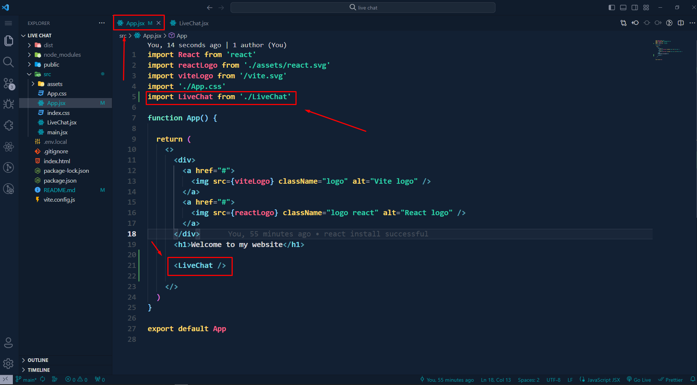

# How to add live chat feature in your website using React

### Step 1:
Open your React project or create

### Step 2: 
Open your terminal and install<br/>
```sh
npm i react-messenger-customer-chat
```
### Step 3: 
Create one page like: LiveChat.jsx
Past this code in your "LiveChat" page

```jsx
import React from 'react'
import MessengerCustomerChat from 'react-messenger-customer-chat';

const LiveChat = () => {
    return (
        <div>
            <MessengerCustomerChat
              pageId="Enter your Page id"
              appId="Enter your App id"
            />,
      </div>
    )
}

export default LiveChat
```
`Note: If you have any problem to find Facebook page ID and APP Id, you can search google or YouTube`
`"How to Find Facebook Page Id"`
`"How to create facebook app id"`

### Step 4:
Link your "LiveChat page" in "App.jsx" page



### Step 5:
Run this command:
```sh
npm run build
```

### Step 6:
Deploy your website to your domain/Firebase or Netlify

### Step 7:
Copy your Website URL

### Step 8:
Go to your Facebook page>Settings>Advanced Messaging> Whitelisted domains option and add your website URL in input field and click add button 